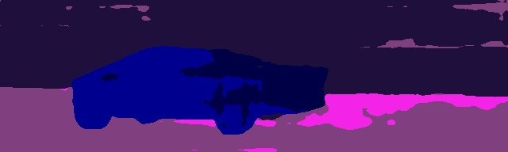

# Rust - Monocular Depth Prediction

A repo for testing Rust inferencing from models built by torch.jit.tracing PyTorch models.

Using:
- [tch-rs](https://github.com/LaurentMazare/tch-rs) - Rust bindings for PyTorch
- [monodepth2](https://github.com/nianticlabs/monodepth2) - Monocular depth estimation from a single image
- [semantic-segmentation](https://github.com/NVIDIA/semantic-segmentation) - Improving Semantic Segmentation via Video Propagation and Label Relaxation


<p align="center">
  
</p>

Mono RGB | Depth Prediction
------------ | -------------
 | 
 | 
 | 
 | 

Mono RGB | Semantic Segmentation
------------ | -------------
 | 
 | 
 | 
 | 

Reference:
```
@article{monodepth2,
  title     = {Digging into Self-Supervised Monocular Depth Prediction},
  author    = {Cl{\'{e}}ment Godard and
               Oisin {Mac Aodha} and
               Michael Firman and
               Gabriel J. Brostow},
  booktitle = {The International Conference on Computer Vision (ICCV)},
  month = {October},
  year = {2019}
}
```
```
@inproceedings{semantic_cvpr19,
  author       = {Yi Zhu*, Karan Sapra*, Fitsum A. Reda, Kevin J. Shih, Shawn Newsam, Andrew Tao, Bryan Catanzaro},
  title        = {Improving Semantic Segmentation via Video Propagation and Label Relaxation},
  booktitle    = {IEEE Conference on Computer Vision and Pattern Recognition (CVPR)},
  month        = {June},
  year         = {2019},
  url          = {https://nv-adlr.github.io/publication/2018-Segmentation}
}
* indicates equal contribution

@inproceedings{reda2018sdc,
  title={SDC-Net: Video prediction using spatially-displaced convolution},
  author={Reda, Fitsum A and Liu, Guilin and Shih, Kevin J and Kirby, Robert and Barker, Jon and Tarjan, David and Tao, Andrew and Catanzaro, Bryan},
  booktitle={Proceedings of the European Conference on Computer Vision (ECCV)},
  pages={718--733},
  year={2018}
}
```